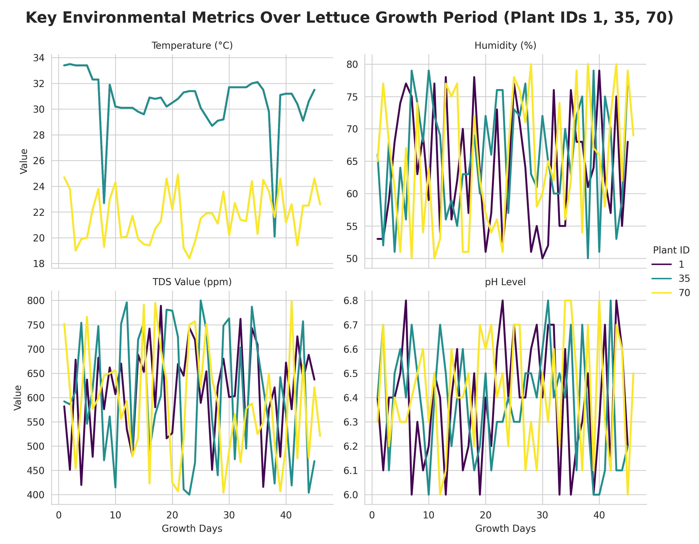

# Coming soon...

 
 

# Apache 2.0 License

<iframe src="https://www.kaggle.com/embed/robatalla/lettuce-try-coding-in-python?cellIds=1&kernelSessionId=276061639" height="300" style="margin: 0 auto; width: 100%; max-width: 950px;" frameborder="0" scrolling="auto" title="Lettuce Try Coding in Python"></iframe>

# Output

